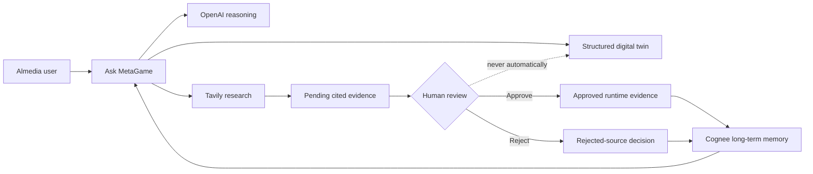

# MetaGame

MetaGame is an AI-assisted digital twin of Almedia's global rewarded user-acquisition business. It combines an interactive geographic view of users, games, growth potential, infrastructure pressure, and modeled economics with an agent that can research new evidence, explain business trade-offs, and remember approved decisions.

The project is built for the Almedia Hackathon in Berlin. Its central idea is that a business dashboard should not be a static collection of charts: it should maintain a structured belief state, expose the certainty and freshness of that state, and let a human-supervised agent improve it over time.

## What the product shows

### Interactive geographic twin

- A dark, rotating 3D globe with distinct space, ocean, missing-data land, and data colors.
- Smooth transition from the globe into a tightly framed 2D continent view.
- Continent and country choropleths with country labels, hover metrics, and detail panels.
- Game filtering across both map levels. Selecting a game recalculates continent and country values for that game; **All** is the exact sum of every seeded game.
- Time travel across modeled May, June, and July 2026 snapshots.
- Freshness outlines that distinguish fresh, review, and stale records.

### Focused map modes

- **Users:** user magnitude is encoded by a shared teal-to-purple scale; shade intensity represents certainty.
- **Growth potential:** estimated untapped users and opportunity scores, clearly labeled as modeled.
- **Latency & capacity:** p95 postback latency, failure rate, queue lag, utilization, headroom, and severity using a teal-to-amber-to-red scale.

### Business decision model

MetaGame includes editable scenario assumptions for:

- Advertiser revenue per verified completion.
- User rewards and variable operational costs.
- Paid-completion and monthly-active-user rates.
- Contribution profit and margin by game.
- Game onboarding cost, ramp-up value, risk, and payback.
- Infrastructure upgrade cost, ongoing cost, recovered revenue, and payback.

These values support comparisons and demonstrations; they are not presented as Almedia's internal financial accounts.

### Ask MetaGame

The in-product chat is a concise business analyst grounded in the current twin. It can answer questions about users, game economics, opportunity, infrastructure, onboarding, profitability, and risk.

The agent is designed to avoid unsupported conclusions:

- It uses only supplied twin data and retrieved evidence.
- It distinguishes sourced facts, modeled estimates, and unknowns.
- It requests missing decision inputs instead of inventing candidates or numbers.
- It treats the seeded games as the current portfolio, not automatically as new onboarding candidates.
- Answers are intentionally short and decision-focused.

## Agent and evidence workflow



### OpenAI

OpenAI's Responses API interprets the structured twin and returns concise business analysis. The API key remains server-side. The prompt prohibits unsupported figures, requires missing-input checks, and prevents the agent from claiming it executed operational or financial actions.

### Tavily

Tavily provides current web research when a question requires recent evidence. Results retain their title, URL, extracted claim, relevance score, publication date when available, and retrieval time. They remain pending until a user explicitly approves or rejects them.

### Cognee

Cognee is the agent's persistent memory, not the authoritative database. It stores approved evidence and rejected-source decisions in separate datasets. Relevant memories are recalled into later conversations and persist across backend restarts. Cognee cannot directly overwrite numeric twin records.

### Human-controlled updates

Country refreshes and research follow proposal workflows. The UI shows the current and proposed state, evidence, confidence, and reasoning before approval. Historical snapshots remain unchanged when a current runtime estimate is updated.

## Resilience and fallbacks

The map and chat remain usable when a provider is unavailable, rate-limited, or out of credits:

| Service | Primary role | Fallback |
|---|---|---|
| OpenAI | Business reasoning | Deterministic answers calculated from the local twin |
| Tavily | Current web research | Existing local source catalog |
| Cognee | Persistent agent memory | Approved evidence held in the running application, with failed writes marked for retry |

Short circuit breakers prevent repeated calls to a temporarily failing provider. The interface labels local fallback answers rather than silently presenting them as model output.

## Data model

The local structured state contains:

- `continents`
- `countries`
- `games`
- generated country-game allocations
- historical snapshots
- freshness and confidence policies
- modeled country infrastructure
- business and onboarding assumptions
- public source metadata

The country-game allocation is remainder-safe: every game's users sum exactly to its country total, and every continent's **All** value equals the sum of its game-filter values.

Public sources do not disclose exact Freecash user totals by country and game, Almedia infrastructure telemetry, or internal unit economics. MetaGame therefore separates reported facts from modeled estimates and missing data. Full methodology, limitations, source URLs, and visual rules are documented in [DATA_SOURCES.md](DATA_SOURCES.md).

## Technology

- React 19 and TypeScript
- Vite and Tailwind CSS
- MapLibre GL JS
- Node.js and Express
- JSON-based prototype database
- OpenAI Responses API
- Tavily Search API
- Cognee Cloud memory

## Architecture

```text
React / MapLibre frontend
        │
        ▼
Express twin API
        ├── Structured JSON state and deterministic calculations
        ├── OpenAI reasoning
        ├── Tavily research
        └── Cognee persistent memory
```

All provider credentials are read only by the backend. No API key is exposed through Vite or committed to Git.

## Run locally

Requirements: Node.js 20 or newer and npm.

```bash
npm install
cp .env.example .env
```

Configure the required provider credentials in the ignored `.env` file:

```dotenv
OPENAI_API_KEY=...
OPENAI_MODEL=gpt-5.6-sol
TAVILY_API_KEY=...
COGNEE_API_KEY=...
COGNEE_BASE_URL=https://your-tenant.aws.cognee.ai
```

Start the backend:

```bash
npm run start:server
```

Start the frontend in another terminal:

```bash
npm run dev
```

Open the URL printed by Vite. The API defaults to `http://localhost:3001`.

The application also runs without provider credentials by using its local fallbacks.

## Demo flow

1. Explore the rotating globe and hover over continents.
2. Select a game and confirm that continent values and colors change.
3. Enter a continent and inspect countries and their game distribution.
4. Switch between Users, Growth potential, and Latency & capacity.
5. Move through historical snapshots.
6. Open a country and demonstrate a proposed deterministic refresh.
7. Ask MetaGame about profitability, infrastructure investment, or missing opportunities.
8. Trigger current research, inspect its citations, and approve or reject the evidence.
9. Explain that Cognee remembers the reviewed decision after a restart.

## API overview

### Twin data

- `GET /health`
- `GET /twin/meta`
- `GET /twin/games`
- `GET /twin/snapshots`
- `GET /twin/continents?asOf=<date>&game=<id|all>`
- `GET /twin/countries?continent=<id>&asOf=<date>`
- `GET /twin/economics`
- `GET /twin/validation`
- `GET /twin/attention`

### Agent and research

- `POST /twin/agent/chat`
- `POST /twin/research/propose`
- `POST /twin/research/:id/apply`
- `POST /twin/research/:id/reject`

### Refresh and memory

- `POST /twin/refresh/propose`
- `POST /twin/refresh/proposals/:id/apply`
- `POST /twin/refresh/proposals/:id/reject`
- `POST /twin/refresh/reset`
- `GET /twin/memory/status`
- `POST /twin/memory/retry/:id`
- `GET /twin/services/status`

## Verification

```bash
npm run build
npm run lint
```

## Prototype limitations

- Geographic, growth, capacity, and financial figures are scenario estimates unless explicitly marked as sourced.
- Only publicly identifiable markets and campaigns are seeded; this is not Almedia's complete operational footprint.
- The JSON store and in-memory proposal state are appropriate for a hackathon prototype, not a multi-instance production deployment.
- Production deployment would require authenticated users, a transactional database, audit logs, secrets management, monitoring, and first-party Almedia telemetry.
